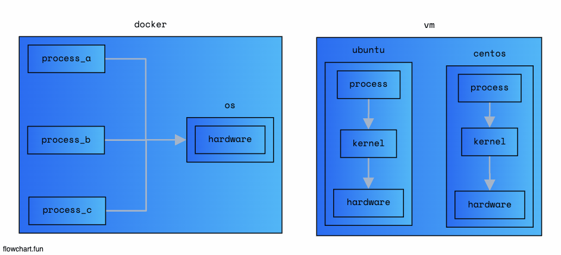
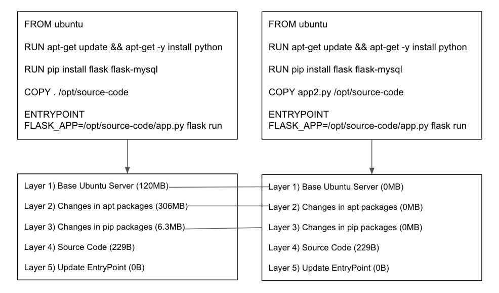
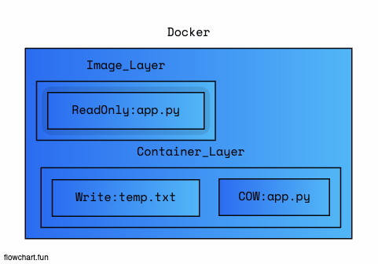
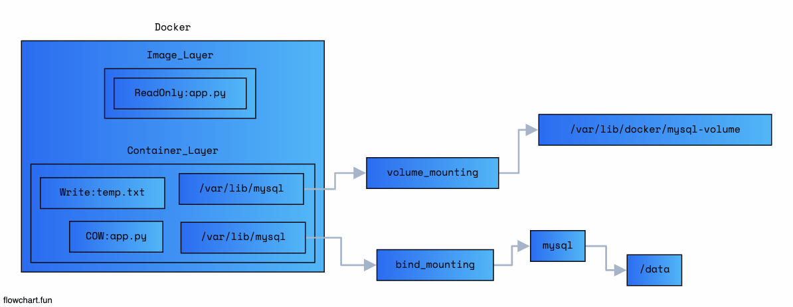
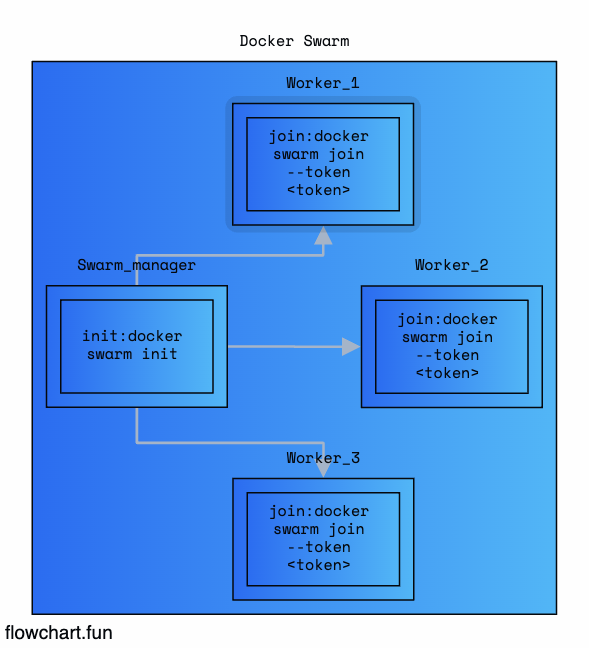
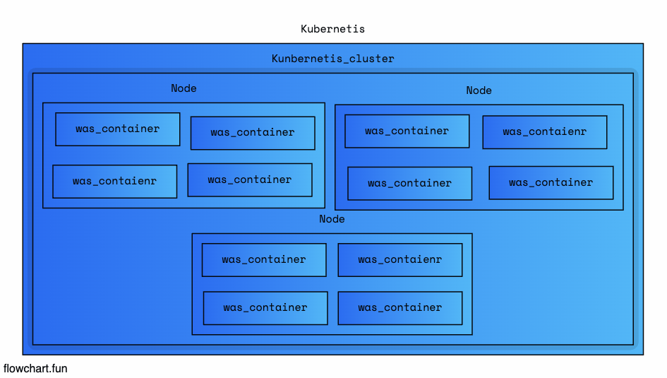

# Docker Best Practice roles Devops



## Desc

> Community Edition

    - Free

> Enterprice Edition

    - Paid
    - Management Container Runtime
    - Management Orchestration

## Pre-Execute

```
    https://github.com/zkfmapf123/infra-automation
```

## 1. Docker Run Command

```
    docker pull jenkins/jenkins:lts

    docker run -d --name jenkins_conatiner \                // Naming
    -p 8080:8080 -p 50000:50000 \                           // Port Mapping
    -v /root/my-jenkins-data:/var/jenkins_home \            // Volume
    -u root --restart always \                              // User & Restart Option
    jenkins/jenkins:lts                                     // Image
```

## 2. 도커 이미지 허브에 올리는 방법

### Docker Registery

```
    images: docker.io  /      nginx      /         nginx
            <Registry> / < User Account> / < Image Or Repository>

    example)
        docker push zkfmapf123/node-todolist-e2e-test:1.0
```

### Private Docker Registry

- <a href="https://hub.docker.com/_/registry"> Docker Registry </a>

```
    docker run -d -p 5000:5000 --name registry registry:2

    docker images tag my-image localhost:5000/my-image

    docker push localhost:5000/my-image

    docker pull localhost:5000/my-image (in localhost)
    docker pull 192.168.56.100:5000/my-image (other host)
```

### push image to docker hub

```

    // 1. 도커 로그인
    docker login

    // 2. 이미지 생성
    docker build . -f [Docker path] -t [Image Name]
    docker build . -f Dockerfile -t simple_app

    // 3. 이미지 태그 attach
    docker tag [Docker iamge name] [docker hub id]/[docker image name]:[version]
    docker tag simple_app:latest zkfmapf123/simple_app:1.0

    // 4. docker push [Docker image name]
    docker push zkfmapf123/simple_app:1.0

    // 5. pull docker images
    docker pull zkfmapf123/simple_app:1.0
```

## 3. Docker Engine

### 분리된 컨테이너에서 Docker Container들은 어떻게 통신을 할까?

> Namespace

- VM 같은 경우는, 각 Guest Machine별로 동작하기 때문에 각각의 고유 Isolation을 지원한다.
- Docker는 Guest OS가 아닌 NameSpace를 사용하여 Isolation을 지원한다.
- Namespace라는 독립적인 공간을 사용하여 Process단위로 Docker를 사용한다.

```
    // ps -eaf 현재 구동중인 process

    docker run -p -80:80 tomcat_container tomcat:latest
    docker exec tomcat_container ps -eaf
```

> cGroup

- 각각의 컨테이너의 자원의 할당을 제어할 수 있다. (Quantity Hardware Resource)

```
    docker run --cpus=.5 ubuntu
    docker run --memory=100m ubuntu
```

> File System

- Docker 설치 후 Local

```
    /var/lib/docker
        - aufs
        - containers (Docker containers)
        - image (Docker images)
        - volumes (Docker Volumes)
            - mysql_volume

```



- DockerFile은 Layer 형식으로 진행이 되는데, 이때, 같은 Layer라면 다른 Dockerfile 이어도 Cacing이 가능하다
- 동일하게 EntryPoint나 그 밑 부분의 Layer만 변경한다면 그 윗부분은 Cacing이 이미 되어있기 때문에 빠르게 Build가 가능하다



- Iamge_Layer는 Readonly 영역이기 때문에 이미 Image가 만들어진 이상 변경이 불가능
- Container_Layer는 변경이 가능하다. 대신 COW(Copy-on-Write) 방식으로 Container영역의 app.py를 수정가능하다.
- 이러한 Container가 없어지면 (docker rm `docker ps -a -q`) 했을때 데이터를 보존하기 위해서 volume을 사용한다

> Volume Mounting vs Bind Mounting



- Volume을 사용해서 Container영역 (Write)에 데이터를 Local에 저장한다. (Volume Mounting)

  ```
    // docker use volume
    docker volume create mysql_volume
    docker run -v mysql_volume:...
  ```

- Host file System의 특정 경로를 Container로 바로 mount할 수 있다 (Bind Mounting)

  ```
    // old
    docker run -v `pwd`:/app ...

    // new
    docker run \
    --mount type=bind, \
    source=/data/mysql, \   (Host 위치)
    target=/var/lib/mysql \ (Container 위치)
    mysql
  ```

## Docker Orchestration

[!orchestration](./public/orchestration)

- n개의 Container들의 성능과 상태를 모니터링
- A Container, Others Container들과의 Networking
- Load Balancing
- 요구수준에 맞춘 Scale-up
- 대규모 어플리케이션의 전체적인 관리
- Container Orechestration => ECS, EKS, Docker Swarm, Kubernetis

> Docker Swarm



- 설정과 시작이 간단함
- 복잡한 프로덕션 애플리케이션에 필요한 고급 Auto Scaling 기능이 부족

```
    // 관리자 기준에서 작성
    docker service create --relicas=3 was_container
    docker service create --relicas=3 -p 8080:80 was_container
    docker service create --relicas=3 --netowkr frontend was
```

> Kubernetis



- 설정과 시작이 복잡함
- 사용자 정의 배포 옵션을 제공 + 여러 벤더를 제공함 (AWS, GCP, Azure...)

```
    kubectl rolling-update was_contaienr --rollback
    kubectl rolling-update was_container --image=web-server:2
    kubectl scale --replicas=2000 was_container
    kubectl run --replicas=1000 was_contaienr
```

## ...

- docker images의 용량을 줄이기위해 왠만하면 :alpine 이미지를 쓰자
- alpine이미지는 docker exec -it [docker_container] /bin/bash가 안먹힘 -> /bin/sh
- 현재 나의 컴퓨터는 mac(arm64), ec2 컴퓨터는 ubuntu(x86_64) 환경에 따른 이미지를 생성해야 한다.
